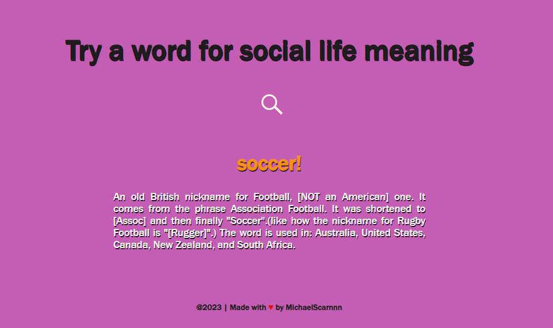
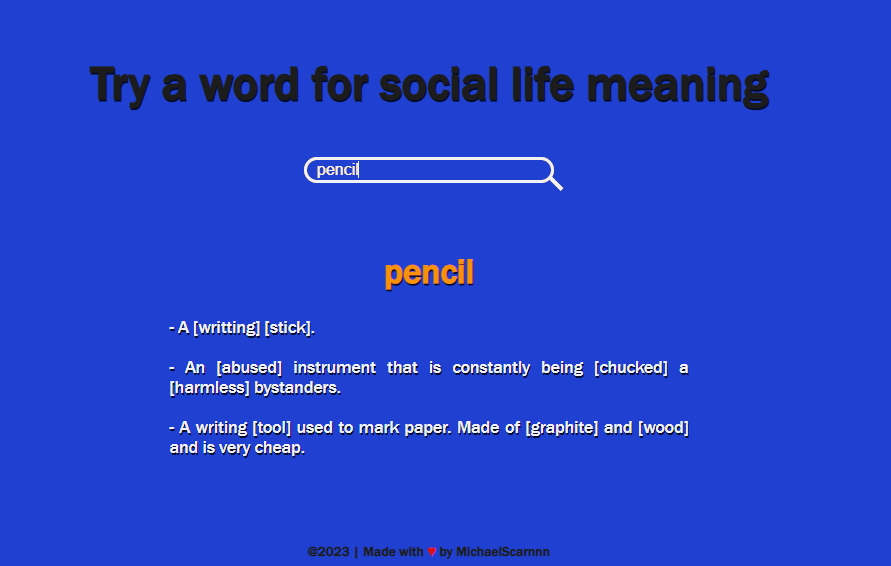

# Try A Word

- This project was made by using the [urban dictionary](https://rapidapi.com/community/api/urban-dictionary) API. It brings up 3 possible explanations of the word whose meaning is curious.
    

# How it works?

- After the HTML and CSS files are made, we need the url and key information in order to access the data with the API in the JavaScript file. The key information is a unique key that is produced specifically for the person.
    
- After adding the method and headers values​ for the Options object I created, I can pull the information I want from the Urban Dictionary site and embed the information coming with the DOM into my HTML tag.
    
- In order to embed it in HTML in a readable way, I define variables and constraints in json() format and object that will bring me the part I want. I also created a function that will make my background color change every time I refresh the page.

# For running
- Cloning the repository the local machine and use your own uniq API key.
`git clone https://github.com/MichaelScarnnn/try-a-word`
